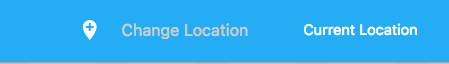
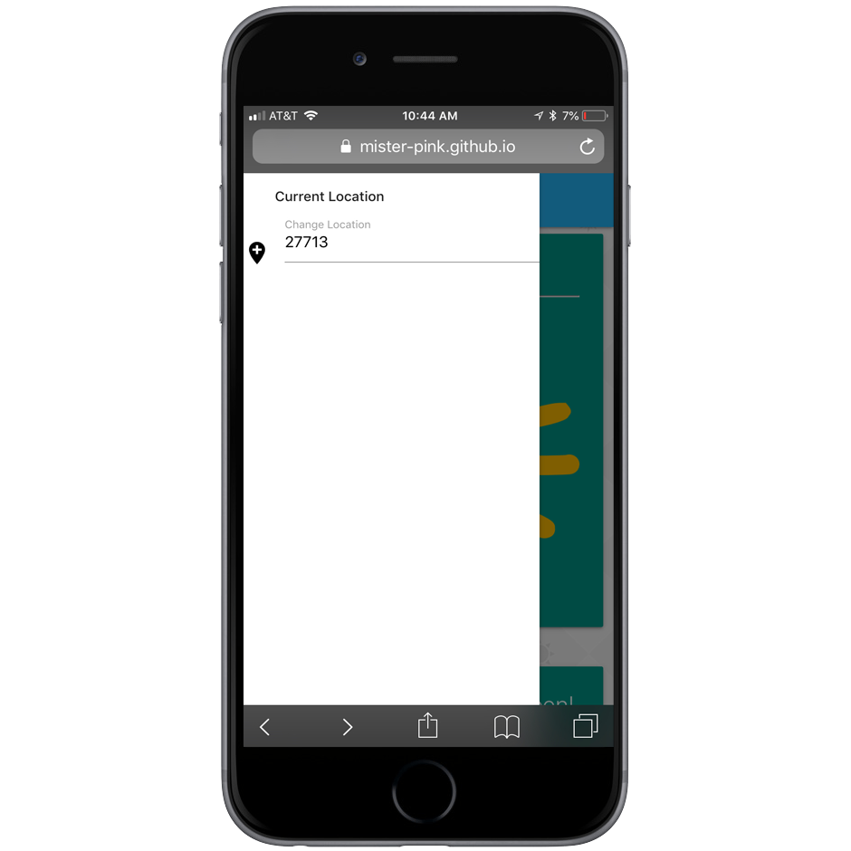
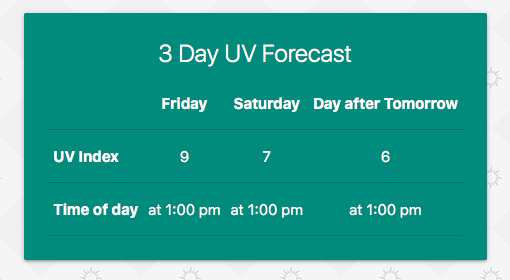
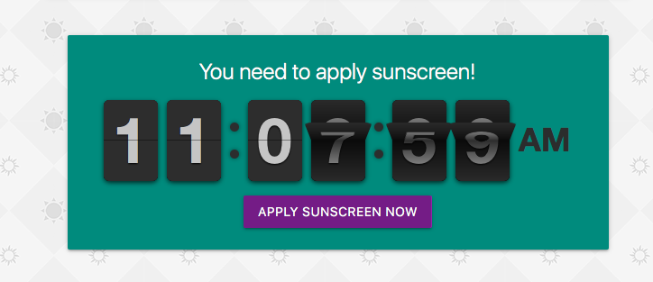
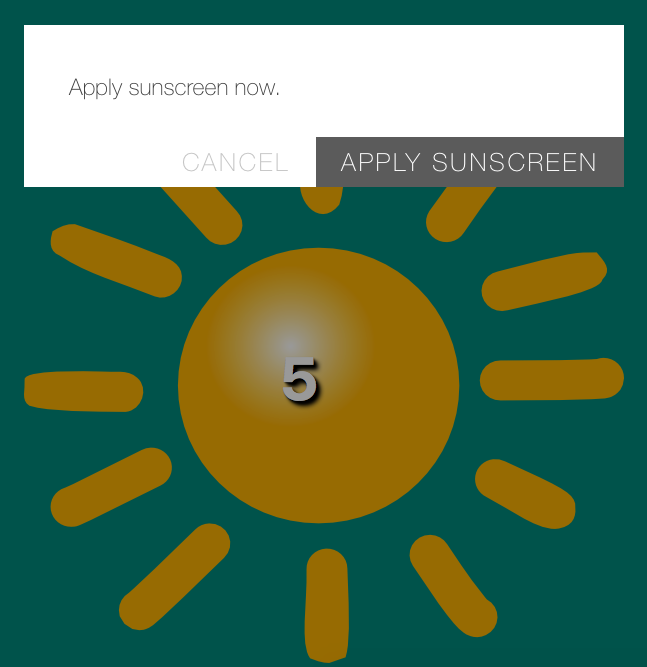
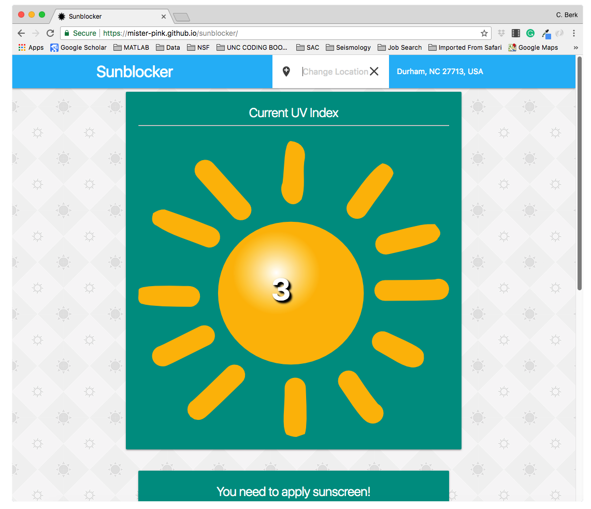
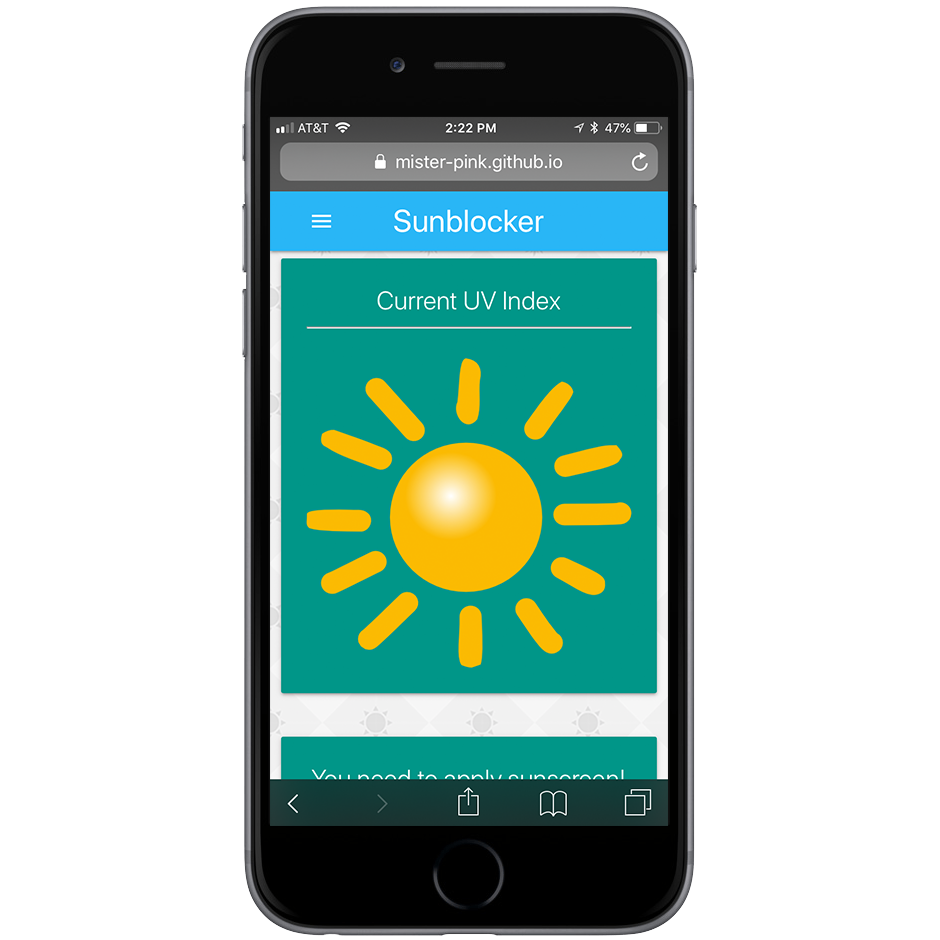

# Sun Blocker 

Application that allows user to check the local UV index and set a timer to be reminded to reapply sunscreen.

## Utilizes 

* jQuery
* JavaScript
* HTML
* CSS
* moment.js
* Firebase
* Materialize CSS Framework
* Vex (modal library)
* AJAX
* Google Maps API
* Dark Sky Weather API
---
## Functionality

* Depending on the platform of choice, displays a user input element on the top or as a collapsible side bar (for mobile devices) to acquire location information for the UV Index query. 

---

* The Google Maps API Geocoder functionality allows the user to input any choice of zip codes, cities or specific adresses and returns a JSON object containing a short, generic  adress string and Latitude and Longitude. The address information is displayed on the "current location" section both on the side and top bar upon completion of query.

* The Coordinates are passed to Dark Sky API in order to obtain the current UV Indexes as well as forecasted peak UV Indexes(and the times) for the following two days. 

---

* The App also provides a timer functionality that would remind the user to reaply Sun Screen after they set a timer located below the main container. Based on the recomendation of U.S. EPA this is automatically set at **2 hours**. A modal is designed using **Vex** to alert user to reaply suncreen at the end of the 2 hour period.

---
## Responsiveness

Fully functional on devices with variety of display sizes. 

---

 
